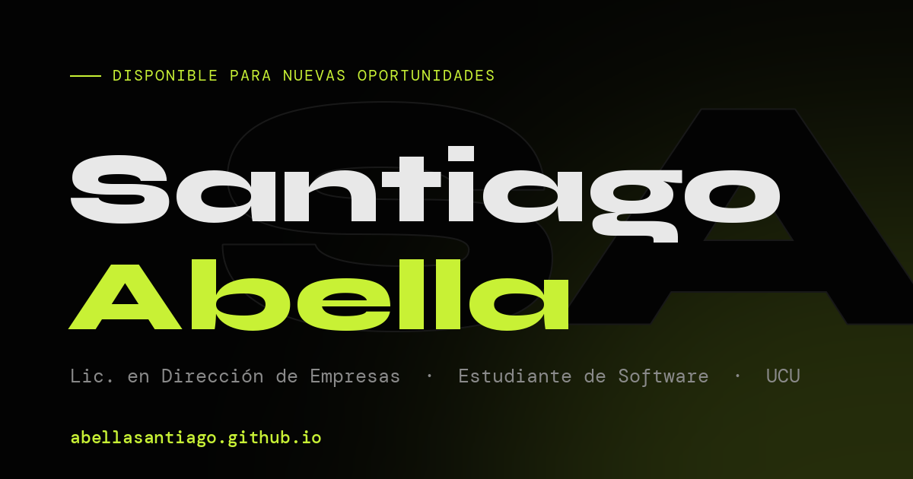

# Portfolio ✦

Mi portfolio personal. Hecho desde cero con HTML, CSS y JS — sin frameworks ni build tools.

**[→ Ver en vivo](https://abellasantiago.github.io/)**



---

## ¿Qué es esto?

Un sitio web que construí para mostrar quién soy y en qué estoy trabajando.

Actualmente estoy cursando una Tecnicatura en Desarrollo de Software en la UCU, así que esto también es parte del proceso de aprender haciendo.

---

## Stack

- **HTML / CSS / JS vanilla** — sin frameworks, sin build
- **Three.js** (r128) — icosaedro 3D del hero
- **Lenis** — smooth scroll
- **Canvas 2D** — campo de partículas neural + logo "SA"
- **Google Fonts** — Syne + DM Mono

---

## Features

- Intro animado estilo terminal
- Icosaedro 3D que late en el hero y se deconstruye al scrollear
- Red de partículas interactiva (canvas) que reacciona al cursor
- Cámara de scroll: parallax por capas, profundidad de campo y motion-blur por velocidad
- Logo "SA" de partículas que converge en espiral
- Grid cells que vuelan desde fuera del viewport al hacer scroll
- Cursor personalizado, scramble en el nombre al hover, glitch en el logo
- Modo claro / oscuro
- Responsive + menú hamburguesa para mobile
- SEO completo (Open Graph, Twitter Card, JSON-LD) y respeto por `prefers-reduced-motion`

---

## Estructura

```
portfolio/
├── index.html
├── style.css
├── script.js
├── 404.html
├── robots.txt
├── sitemap.xml
├── Foto_perfil.jpg
├── CV_Santiago_Abella.pdf
└── favicon.*  (svg · ico · png 32/192)
```

---

## Por qué vanilla y no un framework

Porque quería entender qué pasa debajo antes de usar abstracciones. Puede que en algún momento migre a Next.js, pero por ahora esto hace exactamente lo que necesito.

---

## Deploy

Hosteado en **GitHub Pages** desde la rama `main` → [abellasantiago.github.io](https://abellasantiago.github.io/).

---

## Contacto

[santiagoabella.f@gmail.com](mailto:santiagoabella.f@gmail.com)  
[linkedin.com/in/santiagoabella](https://linkedin.com/in/santiagoabella)
